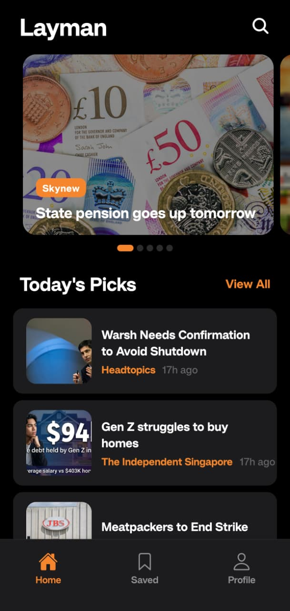
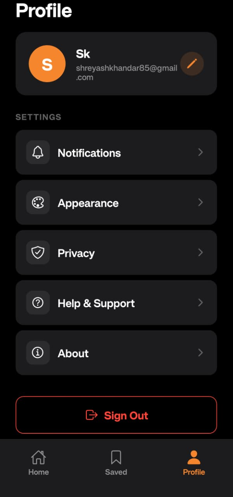
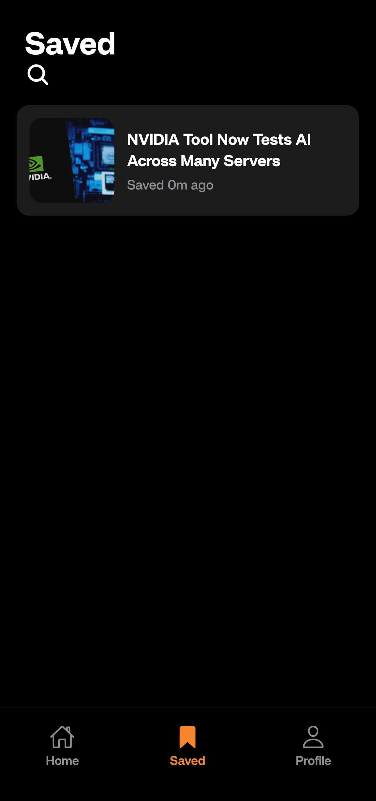
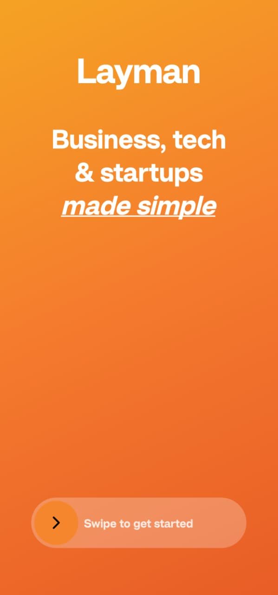

# Layman — Business, Tech & Startups Made Simple

<p align="center">
  <strong>A simplified news reader that takes complex business, tech, and startup news and presents it in plain, everyday language — in layman's terms.</strong>
</p>


------------------------------------------------------------------------

## Download APK

https://expo.dev/artifacts/eas/tr1B4FGkWZd9Dse5REd2Nh.apk

------------------------------------------------------------------------

## Screenshots

<p align="center">
  
  
  
  
</p>
------------------------------------------------------------------------

## About

Layman is a mobile news application built with **React Native (Expo)** that fetches real-time news articles and uses **AI-powered simplification** to make them accessible to everyone. The app breaks down complex headlines and articles into conversational, jargon-free summaries.

### Core Concept
> Take complex news → Simplify with AI → Present in everyday language

---

##  Features

###  Authentication (Supabase)
- Email/password sign-up and sign-in
- Secure session management with persistent login state
- Demo mode when Supabase is not configured
- Password change functionality

### News Feed
- Real-time articles from **NewsData.io** (Business & Technology)
- Featured articles carousel with full-bleed images
- AI-simplified headlines (48–52 characters, conversational tone)
- Pull-to-refresh and infinite scroll
- Search functionality

### Article Detail
- Bold 2-line simplified headline
- **3 swipeable summary cards** (each: 2 sentences, 28–35 words):
  - Card 1: What happened
  - Card 2: Why it matters
  - Card 3: What's next
- Save, share, and open original article actions

### Ask Layman (AI Chat)
- Context-aware AI chatbot for each article
- Factual Q&A format — direct, specific answers under 2 sentences
- 3 auto-generated question suggestions
- Dual AI provider support: **Google Gemini** (primary) + **Groq** (fallback)
- Automatic failover with timeout handling

### Saved Articles
- Bookmark articles with one tap
- Persistent storage via AsyncStorage (survives logout/login)
- Cloud sync via Supabase when configured

### Profile & Settings
- **Edit Profile** — editable display name
- **Notifications** — toggle switches for breaking news, saved article updates, daily digest, trending topics, weekly recap
- **Appearance** — Dark Mode / Light Mode / System (instant switching)
- **Privacy** — Change password (with Supabase verification) + Privacy Policy page
- **Help & Support** — Phone, email contact with FAQs
- **About** — App info, mission, tech stack, developer info

---

## Tech Stack

| Layer | Technology |
|-------|-----------|
| **Framework** | React Native (Expo SDK 54) |
| **Language** | TypeScript |
| **Navigation** | React Navigation (Native Stack + Bottom Tabs) |
| **State Management** | Zustand |
| **Authentication** | Supabase Auth |
| **Database** | Supabase (PostgreSQL with RLS) |
| **News API** | NewsData.io |
| **AI — Primary** | Google Gemini 2.0 Flash |
| **AI — Fallback** | Groq (Llama 3.3 70B Versatile) |
| **Local Storage** | AsyncStorage |
| **UI Icons** | @expo/vector-icons (Ionicons) |
| **Gestures** | react-native-gesture-handler |

---

## Project Structure

```
layman-app/
├── App.tsx                            # Root with ThemeProvider + auth restoration
├── .env                               # API keys (gitignored)
├── babel.config.js                    # dotenv + reanimated plugins
│
└── src/
    ├── constants/
    │   ├── config.ts                  # Environment variable reader
    │   └── theme.ts                   # Dark & Light color palettes, typography, spacing
    │
    ├── contexts/
    │   └── ThemeContext.tsx            # Theme provider (dark/light/system)
    │
    ├── types/
    │   └── index.ts                   # TypeScript interfaces
    │
    ├── services/
    │   ├── supabase.ts                # Auth + saved articles CRUD
    │   ├── news.ts                    # NewsData.io API integration
    │   └── ai.ts                      # Gemini + Groq AI with auto-fallback
    │
    ├── store/
    │   ├── authStore.ts               # Authentication state
    │   ├── articlesStore.ts           # News articles state
    │   ├── savedStore.ts              # Saved articles (AsyncStorage + Supabase)
    │   └── chatStore.ts               # AI chat messages state
    │
    ├── components/
    │   ├── FeaturedCard.tsx            # Carousel card with image overlay
    │   ├── ArticleCard.tsx            # List row with thumbnail
    │   ├── SwipeButton.tsx            # Welcome screen swipe gesture
    │   ├── ContentCard.tsx            # Article summary card (1 of 3)
    │   └── ChatBubble.tsx             # Chat message bubble with "Answer" label
    │
    ├── screens/
    │   ├── auth/
    │   │   ├── WelcomeScreen.tsx      # Gradient + swipe to start
    │   │   └── AuthScreen.tsx         # Sign in / Sign up
    │   ├── home/
    │   │   └── HomeScreen.tsx         # Featured carousel + Today's Picks
    │   ├── article/
    │   │   └── ArticleDetailScreen.tsx # 3 simplified AI cards
    │   ├── chat/
    │   │   └── ChatScreen.tsx         # Ask Layman AI chatbot
    │   ├── saved/
    │   │   └── SavedScreen.tsx        # Bookmarked articles
    │   └── profile/
    │       ├── ProfileScreen.tsx      # User info + settings menu
    │       ├── NotificationsScreen.tsx # Notification toggles
    │       ├── AppearanceScreen.tsx   # Theme selector
    │       ├── PrivacyScreen.tsx      # Change password
    │       ├── PrivacyPolicyScreen.tsx # Privacy policy article
    │       ├── HelpSupportScreen.tsx  # Contact + FAQs
    │       └── AboutScreen.tsx        # App info + credits
    │
    └── navigation/
        ├── AppNavigator.tsx           # Root + tabs + profile stack
        └── types.ts                   # Navigation type definitions
```

---

## Setup & Installation

### Prerequisites
- Node.js 18+
- npm or yarn
- Expo Go app on your phone ([Android](https://play.google.com/store/apps/details?id=host.exp.exponent) / [iOS](https://apps.apple.com/app/expo-go/id982107779))

### 1. Clone the repository
```bash
git clone https://github.com/your-username/layman-app.git
cd layman-app
```

### 2. Install dependencies
```bash
npm install
```

### 3. Configure environment variables
Create a `.env` file in the root directory:
```env
# Supabase Configuration
SUPABASE_URL=https://your-project.supabase.co
SUPABASE_ANON_KEY=your_supabase_anon_key

# NewsData.io API Key
NEWSDATA_API_KEY=your_newsdata_api_key

# Google Gemini AI API Key
GEMINI_API_KEY=your_gemini_api_key

# Groq AI API Key (optional fallback)
GROQ_API_KEY=your_groq_api_key
```

**Where to get API keys:**
| Service | URL | Free Tier |
|---------|-----|-----------|
| Supabase | [supabase.com](https://supabase.com) | 500MB DB, 50K auth users |
| NewsData.io | [newsdata.io](https://newsdata.io) | 200 requests/day |
| Google Gemini | [aistudio.google.com](https://aistudio.google.com/apikey) | 15 RPM |
| Groq | [console.groq.com](https://console.groq.com/keys) | 30 RPM, 14,400 RPD |

### 4. Supabase Database Setup
Run this SQL in your Supabase SQL Editor:
```sql
CREATE TABLE saved_articles (
  id UUID DEFAULT gen_random_uuid() PRIMARY KEY,
  user_id UUID REFERENCES auth.users(id) ON DELETE CASCADE,
  article_id TEXT NOT NULL,
  title TEXT,
  image_url TEXT,
  source_url TEXT,
  saved_at TIMESTAMPTZ DEFAULT NOW(),
  UNIQUE(user_id, article_id)
);

ALTER TABLE saved_articles ENABLE ROW LEVEL SECURITY;

CREATE POLICY "Users can manage own saved articles"
  ON saved_articles FOR ALL
  USING (auth.uid() = user_id);
```

### 5. Start the app
```bash
npx expo start
```
Scan the QR code with Expo Go on your phone.

---

## Design

### Theme
The app ships with **Dark Mode** (default), **Light Mode**, and **System** — switchable from Profile → Appearance.

| Element | Dark | Light |
|---------|------|-------|
| Background | `#000000` | `#F2F2F7` |
| Surface | `#1C1C1E` | `#FFFFFF` |
| Accent | `#F5862E` | `#F5862E` |
| Text | `#FFFFFF` | `#000000` |

### Screens (7 required + 5 bonus)
All 7 screens from the assignment are implemented, plus 5 additional profile sub-screens:

| # | Screen | Status |
|---|--------|--------|
| 1 | Welcome | Gradient + swipe gesture |
| 2 | Auth | Sign up / Sign in |
| 3 | Home (Articles) | Carousel + search |
| 4 | Article Detail | 3 AI summary cards |
| 5 | Ask Layman (Chat) | Factual Q&A AI |
| 6 | Saved | Persistent bookmarks |
| 7 | Profile | Editable + settings |
| 8 | Notifications | Toggle switches |
| 9 | Appearance | Dark/Light/System |
| 10 | Privacy | Change password + policy |
| 11 | Help & Support | Contact + FAQs |
| 12 | About | Mission + tech stack |

---

## AI Architecture

```
User action (view article / ask question)
        ↓
   Try Gemini (8s timeout)
        ↓
   Success? → Return result
   Failed?  → Try Groq (10s timeout)
        ↓
   Success? → Return result
   Failed?  → Graceful fallback (no crashes)
```

- **Headlines**: Simplified to 48–52 chars, processed sequentially with 300ms delay
- **Article Cards**: 3 cards with strict JSON output format
- **Chat**: Factual Q&A style — direct answers, no hallucination, under 2 sentences
- **Suggestions**: 3 auto-generated questions per article

---

## Assignment Requirements Mapping

| Requirement | Weight | Implementation |
|------------|--------|---------------|
| **Authentication** | 15% | Supabase auth with email/password, session persistence, sign out, password change |
| **UI & Screens** | 45% | 12 screens, dark/light theme, iOS-style design, smooth animations, gesture support |
| **Chat Module** | 40% | Dual AI (Gemini + Groq), factual Q&A, context-aware, auto-fallback, question suggestions |

---

##  Developer

**Shreyash Khandar**
- Email: shreyashkhandar82@gmail.com
- Phone: +91 8080439270

---

## License

This project is built as an assignment submission. All rights reserved.
